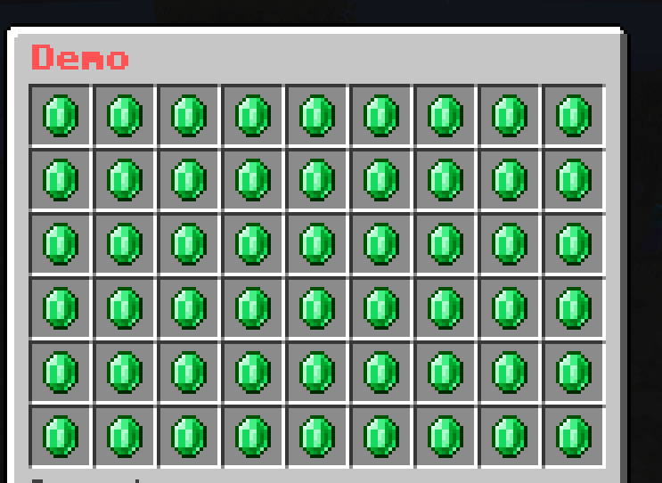
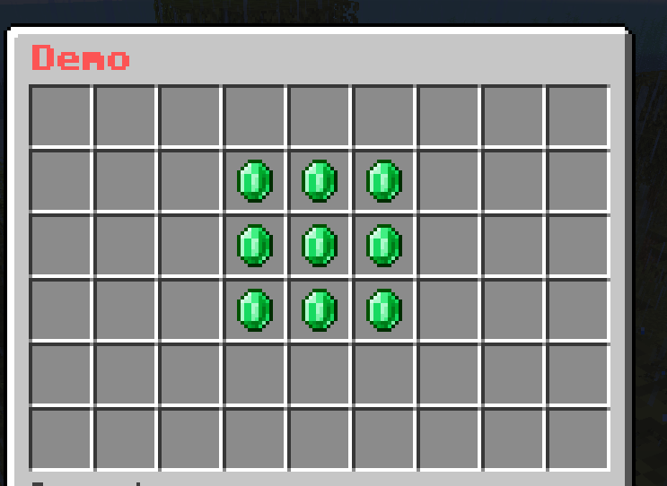
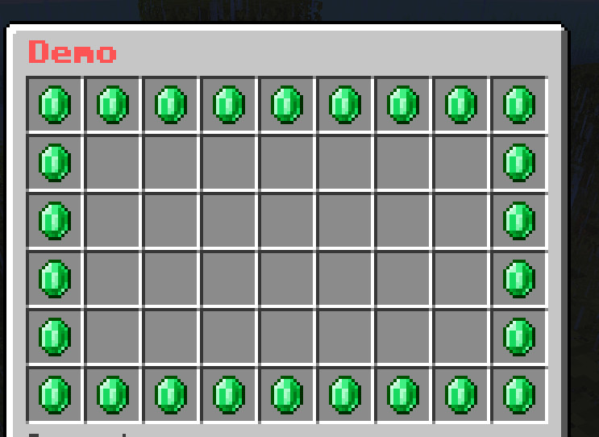

# MaskedGUI 

## Description

**MaskedGUI** is an addon for your existing menus. It introduces new advanced features to make more complex menus and allows for more possibilities, while keeping the same level of simplicity if you are familiar with **BetterGUI**.

Some possible menus you can make with this addon are:
- [A menu with a welcome animation](https://youtu.be/g6r73BCpMU4)
- [Frame-by-frame animation](https://youtu.be/9cmGYL6BTdY)
- [Progress bar](https://youtu.be/txd07psA3NM)
- [Pagination](https://youtu.be/iajNu8t9JnQ)
- _And more!_

## Get Started

After downloading, follow [this guide](../Basic-tutorial.md#add-an-addon) to install the addon.

To start using the addon in your menu, simply set `menu-type` of `menu-settings` to `masked`.

```yaml
menu-settings:
  menu-type: masked
  name: '&c&lExample Menu'
  rows: 6
  ...
```

## Slot Grid

Let's extend the concept of [Slot](../Slot.md) to add more features to it.

Start with this simple menu

```yaml
menu-settings:
  menu-type: masked
  command: demo
  title: "&c&lDemo"
  rows: 6

demo-slot:
  slot: 0-53
  id: emerald
```



You can see that I have set the `slot` to `0-53` which means that the slot will be applied to all slots in the menu.

What if I want to use `slot` to specify a grid of slots, like a 3x3 grid in the middle of the menu?

Here is where I'll introduce a new format for `slot` called **Slot Grid**.

```yaml
slot: <x1>-<y1>-<x2>-<y2>
```

`<x1>` and `<y1>` are the coordinates of the top-left corner of the grid.

`<x2>` and `<y2>` are the coordinates of the bottom-right corner of the grid.

For example, I can replicate the previous menu by using `slot: 1-1-9-6`.

```yaml
demo-slot:
  slot: 1-1-9-6
  id: emerald
```

Or I can make a 3x3 grid in the middle of the menu by using `slot: 4-2-6-4`.

```yaml
demo-slot:
  slot: 4-2-6-4
  id: emerald
```



Cool, right? But what if I only want the outer border of the grid?

You can but `-o` at the end of the `slot` to specify that you want the outer border of the grid.

```yaml
demo-slot:
  slot: 1-1-9-6-o
  id: emerald
```



## Mask

**Mask** is a new component in which you can specify the logic on how the [Buttons](../Button.md) are displayed. This creates new possibilities to make more creative menus from your crazy ideas.

You can use this to make a simple menu

<iframe width="560" height="315" src="https://www.youtube.com/embed/sJhsBfklfOE" title="YouTube video player" frameborder="0" allow="accelerometer; autoplay; clipboard-write; encrypted-media; gyroscope; picture-in-picture; web-share" allowfullscreen></iframe>

... or a more complex menu

<iframe width="560" height="315" src="https://www.youtube.com/embed/g6r73BCpMU4" title="YouTube video player" frameborder="0" allow="accelerometer; autoplay; clipboard-write; encrypted-media; gyroscope; picture-in-picture; web-share" allowfullscreen></iframe>

## Built-in Mask

* Simple Mask
* Multi-Slot Mask
* Pattern Mask
* Progress Mask
* Hybrid Mask
* Animated Mask
* One-Time Animated Mask
* Predicate Mask
* List Mask
* Button Paginated Mask
* Sequence Paginated Mask
* Mask Paginated Mask