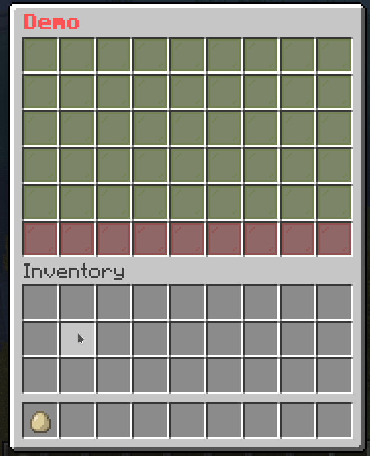

# Hybrid Mask

This mask is a combination of multiple masks. It is useful for grouping masks for better organization.

## Format

```yaml
mask-name:
  mask: hybrid
  child:
    mask-1:
      <mask-settings>
    mask-2:
      <mask-settings>
    ...
```

## Example

```yaml
demo-slot:
  mask: hybrid
  child:
    mask-1:
      slot: 1-1-9-5
      id: green_stained_glass_pane
      name: "&a&lMask 1"
    mask-2:
      slot: 1-6-9-6
      id: red_stained_glass_pane
      name: "&c&lMask 2"
```



```yaml
demo-slot:
  mask: hybrid
  child:
    progress-level:
      mask: progress
      current: "{level}"
      max: 45
      slot: 1-1-9-5
      current-button:
        id: green_stained_glass_pane
        name: "&a&lCurrent: &e{level}"
      max-button:
        id: red_stained_glass_pane
        name: "&c&lMax: &e45"
    give-xp:
      slot: "1-6-9-6"
      id:
        - EXPERIENCE_BOTTLE
        - EXP_BOTTLE
      name: "&eGive &f10 XP"
      lore:
        - ""
        - "&fLevel: {level}"
      click-requirement:
        old-version:
          version: 13
          success-action: "console: xp add {player} 10 points"
          fail-action: "console: xp 10 {player}"
```


To explain what was missed in the example of [Progress Mask](./progress-mask.md), the last row is the [Simple Mask](./simple-mask.md) that gives the player 10 XP. I used the Hybrid Mask to group the Progress Mask and the Simple Mask together.