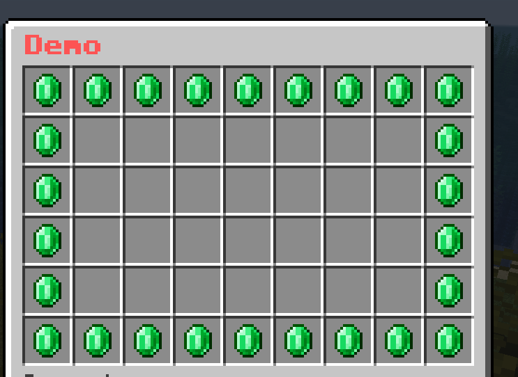
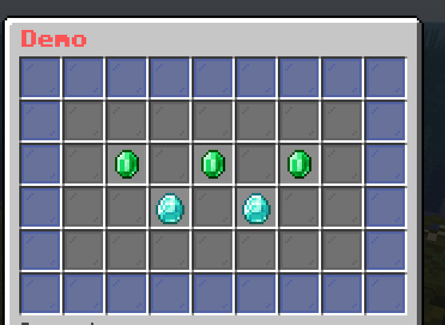

# Pattern Mask

It is a mask that allows you to create a pattern of buttons. The [Buttons](../../../Button.md) are elements that can be used to draw on a grid-like pattern.

## Format

```yaml
mask-name:
  mask: pattern
  pattern:
    - "xxxxxxxxx"
    - "x       x"
    - "x       x"
    - "x       x"
    - "xxxxxxxxx"
  child:
    button-name-1:
      <button-settings>
    button-name-2:
      <button-settings>
    ...
```

The name of each button in the `child` section is the character that is used to draw on the pattern. The character must be unique.

## Example

```yaml
demo-slot:
  mask: pattern
  pattern:
    - "xxxxxxxxx"
    - "x       x"
    - "x       x"
    - "x       x"
    - "x       x"
    - "xxxxxxxxx"
  child:
    x:
      id: emerald
      name: "&a&lEmerald"
```



```yaml
demo-slot:
  mask: pattern
  pattern:
    - "xxxxxxxxx"
    - "x       x"
    - "x 1 1 1 x"
    - "x  2 2  x"
    - "x       x"
    - "xxxxxxxxx"
  child:
    x:
      id: black_stained_glass_pane
      name: "&r"
    ' ':
      id: gray_stained_glass_pane
      name: "&r"
    1:
      id: emerald
      name: "&a&lEmerald"
    2:
      id: diamond
      name: "&b&lDiamond"
```

